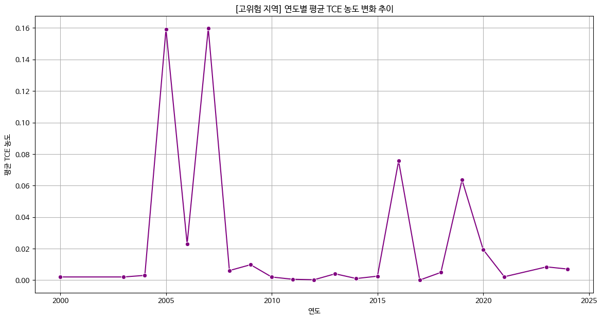
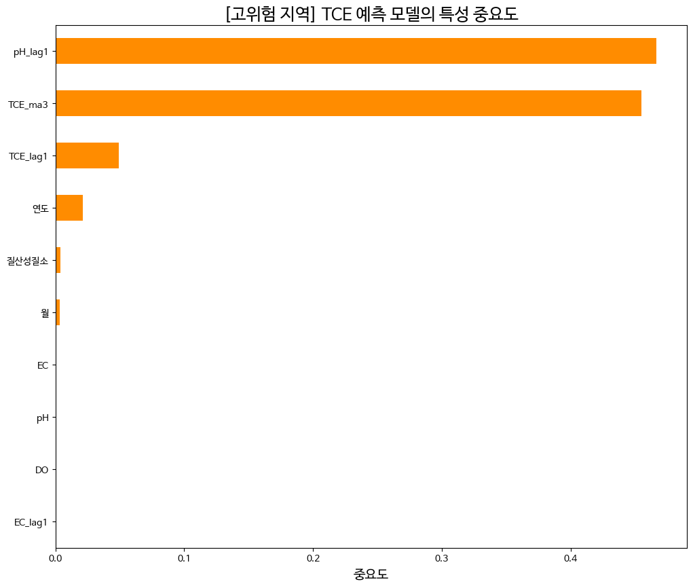

# AI 기반 지하수 오염 예측 및 고위험 지역 분석

[](https://www.kaggle.com/code/hwkims/gims-groundwater-analysis)


**2025 대국민 지하수 빅데이터 공모전 출품작**

## 1. 프로젝트 개요

본 프로젝트는 국가지하수정보센터(GIMS)에서 제공하는 30년간의 지하수 기초조사 데이터를 활용하여, 유해 물질(TCE)의 오염 패턴을 분석하고 미래 오염도를 예측하는 AI 모델을 개발하는 것을 목표로 합니다. 특히, 전국 평균 데이터의 함정에서 벗어나 '고위험 지역'을 특정하고, 해당 지역의 오염 메커니즘을 심층적으로 분석하여 선제적 관리 방안을 제시합니다.

## 2. 데이터 출처

- **주요 데이터:** 전국 지하수 기초조사 원시자료
- **제공 기관:** [국가지하수정보센터(GIMS)](http://www.gims.go.kr/)
- **참고:** 데이터 원본 파일은 용량 및 저작권 문제로 본 리포지토리에 포함하지 않았습니다. 분석 재현은 위 Kaggle 뱃지를 클릭하여 노트북 환경에서 바로 실행할 수 있습니다.

## 3. 분석 파이프라인

1.  **데이터 전처리:** 두 개의 원본 엑셀 파일을 '복합 키' 기준으로 병합하고, '-' 등 문자열 값을 결측치(NaN)로 변환 후, 시계열 보간법을 이용해 데이터 유실을 최소화했습니다.
2.  **고위험 지역 선정:** TCE 농도 상위 5%에 해당하는 관측소를 '고위험 지역'으로 정의하고, 분석 대상을 해당 지역 데이터로 집중했습니다.
3.  **탐색적 데이터 분석 (EDA):** 고위험 지역의 TCE 농도 변화 추이와 공간적 분포를 시각화하여 패턴을 파악했습니다.
4.  **Feature Engineering:** 모델의 예측력을 높이기 위해 과거 데이터(Lag) 및 이동 평균(Moving Average) 파생 변수를 생성했습니다.
5.  **AI 모델링:** XGBoost 회귀 모델을 사용하여 고위험 지역의 미래 TCE 농도를 예측하고, 주요 영향 인자(특성 중요도)를 도출했습니다.
6.  **모델 및 결과물 생성:** 학습된 예측 모델은 Kaggle Notebook 실행 시 `high_risk_tce_predictor.joblib` 파일로 생성되며, 노트북 결과물(Output)에서 다운로드할 수 있습니다.

## 4. 주요 분석 결과

### 4.1. 고위험 지역 TCE 농도 변화 추이



> 고위험 지역의 TCE 평균 농도는 특정 연도에 급등하는 패턴을 보이며, 지속적인 관리가 필요함을 시사합니다.

### 4.2. TCE 예측 모델의 특성 중요도



> 모델 분석 결과, '과거 TCE 농도(TCE_lag1, TCE_ma3)'가 미래 오염 예측에 가장 큰 영향을 미치는 것으로 나타났습니다. 이는 오염의 지속성과 과거 이력의 중요성을 증명합니다. 또한 '월', '연도'와 같은 시간적 요인과 'pH', 'EC' 등 다른 수질 인자도 유의미한 예측 변수임이 확인되었습니다.

## 5. 결론 및 제언

- **결론:** 지하수 오염은 특정 '고위험 지역'에 집중되어 있으며, 과거 오염 이력과 주변 수질 환경이 미래 오염도를 예측하는 핵심 열쇠임을 AI 모델을 통해 입증했습니다.
- **제언:** 본 모델을 활용하여 고위험 지역에 대한 상시 모니터링 체계를 강화하고, 주요 변수(수위, EC 등) 변화 시 조기 경보를 발령하는 '선제적 관리 시스템' 도입을 제안합니다.

## 6. 실행 방법

### **방법 1: Kaggle에서 직접 실행 (권장)**

1.  이 페이지 상단의 **Kaggle 뱃지**를 클릭하여 분석 노트북으로 이동합니다.
2.  우측 상단의 **[Copy and Edit]** 버튼을 클릭하여 자신의 편집 환경으로 복사합니다.
3.  노트북을 전체 실행하면 모든 결과를 동일하게 재현할 수 있으며, `Output` 탭에서 학습된 모델 파일(`high_risk_tce_predictor.joblib`)을 다운로드할 수 있습니다.

### **방법 2: 로컬 환경에서 실행**

1.  이 리포지토리를 클론하거나 파일들을 다운로드합니다.
2.  필요한 라이브러리를 설치합니다.
    ```bash
    pip install -r requirements.txt
    ```
3.  `groundwater_analysis.ipynb` 파일을 주피터 노트북 환경에서 실행합니다. (**주의:** 데이터 파일 경로를 로컬 환경에 맞게 수정해야 합니다.)

---
*이 리포지토리에 포함된 파일 목록:*
- `README.md`: 프로젝트 설명서
- `groundwater_analysis.ipynb`: 전체 분석 과정이 담긴 Jupyter Notebook 파일
- `requirements.txt`: 실행에 필요한 Python 라이브러리 목록
- `tce_trend_high_risk.png`: 분석 결과 이미지 1
- `feature_importance.png`: 분석 결과 이미지 2
